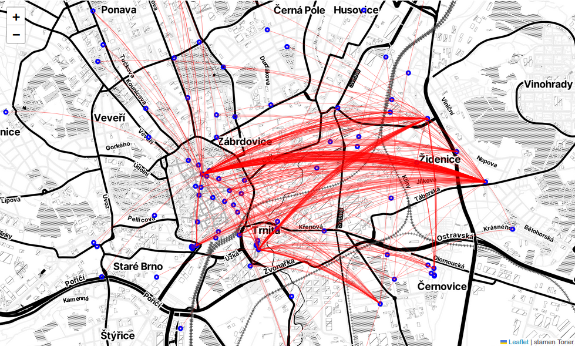

# nextbike login and activity analysis

In this repo I show how to log in and get list of rentals from nextbike API. I ride it a lot and wanted to have some statistics.

I took inspiration from other nextbike projects:
- https://github.com/bdmbdsm/nextbike_api
- https://github.com/cybre-finn/nextbike-api-reverse-engineering

# scripts

## login.py

[login.py](login.py) will print login response from which you can find a "login key", and then use it with [get_list.py](get_list.py). 

Run as `MOBILE="+420735589654" PIN=232523 ./login.py` and find `login_key` in the output.

## get_list.py

[get_list.py](get_list.py) will download list of your activities to `list.json`. You can then analyze the file.

Run as `LOGIN_KEY=sg9032rj32r09rj3 ./get_list.py` and see file `list.json`.

The downloaded json document contains map with keys `server_time`, `user` and `account`. `account` is a map containing key `items` which is a list of "nodes", maps of types `voucher`, `payment` and `rental`. `rental` nodes are data about pickup and return of a bike. Those are the interesting part.

The `rental` nodes are maps with keys like `start_time`, `start_place_latitude`, `start_place_longitude`, `end_time` and so on. There's mode, but the time and return and end places of rentals are relevant for my analysis.

# Analysis

The analysis filters rentals from the list.json and shows totals, month and day aggregation, and a map. I first process list.json into a dataframe which I saved as df.h5 in the repo, so that I don't have to put my list.json here.

In [analysis.ipynb](analysis.ipynb)

# My results January 2023 - May 2024

- Total distance travelled: 1041 km [0]
- Total time spent: 77 hours
- Total trips: 409

[0] I measured that my most common ride is 3.01 km aerial and 3.8 km on the map, so I factor all measured distances by 1.25
